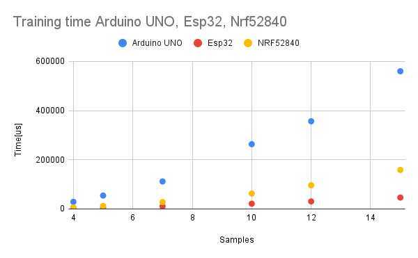

# TinyDecisionTreeClassifier
## Introduction

TinyDecisionTreeClassifier is a simple but elegant standalone library for training decision trees directly on the edge. Decision trees were chosen since they are very fast and easily interpretable. 

Main features are:
- Based around classic C4.5 decision tree algorithm for continious variables.
- This is a standalone library. Since the library depends only on <stdint.h> and <stddef.h> it can easily be ported to other frameworks like Mbed. 
- Fast and small. Checkout the benchmarking examples for Arduino Uno, Esp32 and NRF52840 provided in examples folder.
- Simple to use. I tried to make the methods similar to the DecisionTreeClassifier from scikit-learn. If you are familiar with it you will quickly recognize the familiar names like fit(), predict() and score()
- The average comlexity is O(Nlog(N)) (because of the quicksort)
- Template usage allows to train 8-bit models, which boosts performance on 8-bit MCUs.
- Trained tree visualisation is supported via plot() method

## Usage
You can install this library directly from PlatformIO registry or copy TinyDecisionTreeClassifier.h and TinyDecisionTreeClassifier.cpp manually.
Before writing your own code I recommend checking out the examples first. There is physical activity recognition example in examples/sitStandWalkClassificationOnNrf52840.

## Benchmarking
The following picture show the maximum training time on different mcus, the labels and data were generated using random() function. In practice training times are usually shorter. The number of training features was 5.

## Examples
There are several examples available.

### bechmarkingOnArduinoUno
You can change Treetype from int8_t to float and see how it changes the performance.

### bechmarkingOnEsp32
Very fast decision tree training thanks to higher Esp32 clock speed.

### benchmarkingOnNrf52840
Nrf52840 is a good compromise between speed and power consumption. Also, it is often used in smartwatches.

### binaryPhysicalActivityClassificationOnNrf52840

MPU6050 accelerometer is needed to measure the 3 axis acceleration. Any other accel is ok, if you can make it work.  9 features are extracted in total, 3 for each axis: mean, variance and average difference between the current and the previous sample.

After the power is on, the example records data labeled as class 0 for 90s, then the same for class 1. Then automatically classifies the incoming data in a while loop. 
After power is on you can put an accelerometer in idle position. After the 90s you can rotate it by 90 degrees. When the data are measured and the training is complete, the device classifies input in while loop(if the accel is rotated by 90 degree). You can use the similar approach to classify the physical activity(ensure that the accelerometer is in different positions during each training period, so it is not classifying based on mean value only). The LED blinking speed depends on the classified class. 

I managed to classify activity/no activity with this code. You can check the tree that was built in serial terminal.

### sitStandWalkClassificationOnNrf52840

Again, accelerometer is required. This time there are 3 classes and the time interval is around 150s. It is possible to classify sit/walk/stand with this code, however while recording the data you should ensure that the accelerometer is in different positions during each training period.(So it is not classifying based on mean value only). If you want to change the number of classes, use TREE_NUMBER_OF_CLASSES
